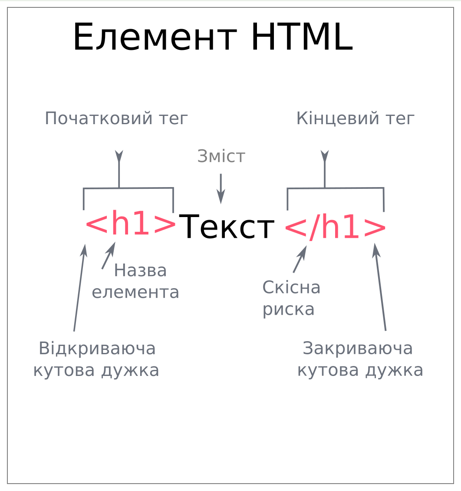

## Знайомство. HTML та тег-заголовок

<details open>
  <summary>Теорія</summary>

Привіт!

#### Що ми будемо робити цього місяця?

Ми зробимо сайт для своєї власної компанії.

Для цього ми познайомимося з мовами, які знаходяться у браузері:

1. HTML - мова розмітки;
2. CSS - мова опису зовнішнього вигляду документу;


Ми дізнаємось:

- для чого потрібні та як працюють `теги HTML`;
- як оформлюється і структурується веб-сторінка завдяки `CSS`;

Вивчати роботу мов IT просто - тому що це письмові мови, тобто звичайний текст.

Текст програм ми записуватимемо в редакторі.
Для HTML/CSS зазвичай використовують редактор Visual Studio Code.
Але на нашому сайті ми писатимемо текст одразу у вікні браузера, у редакторах з темним фоном праворуч.

Для кожної мови буде буде своє вікно,
але тільки в одному з цих вікон можна буде писати код.
У якому саме - залежатиме від теми, яку вивчатимемо.

Результат роботи браузеру ми побачимо у вікні під редакторами.
Це вікно можна збільшити.

Результат перевірки можна побачити після кліку на кнопку "Перевірити".
Якщо все зроблено вірно, то можна натиснути на кнопку переходу до наступного завдання.

#### Що таке HTML

**HTML** - це спеціальний текст, який розуміє браузер. Браузер читає HTML-текст і показує його в зрозумілому і зручному для нас вигляді. Такі тексти зберігають у файлах з розширенням `.html`

Окремі частини такого тексту називаються **HTML-теги**.

**Теги** - це спосіб підказати браузеру, як виділити та показати контент.

#### Синтаксис тегу



На веб-сторінках **основний заголовок h1** використовується тільки один раз, як основний заголовок сторінки.

Наприклад, для його створення використовується тег '&lt;h1&gt;':

```html
<h1>Заголовок сторінки</h1>
```

**Приклад відображення у браузері**

<div class="browser">
   <h1>Заголовок сторінки</h1>
</div>

</details>

<h3 class="task">Завдання</h3>

Напишіть заголовок `h1` з назвою своєї компанії.

<h3 class="test">Критерії виконання завдання</h3>

- Код повинен містити тег-заголовок з назвою своєї компанії `h1`;
- Текст заголовку не має бути порожнім;
- Інших тегів в тексті бути не повинно.