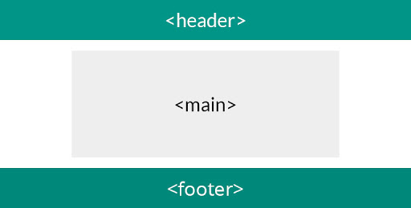

## HTML. Структура документа

<details open>
  <summary>Теорія</summary>

#### Теги `header`, `main`, `footer`

Майже усі веб-сторінки мають три основних структурних елемента.



Тег `header` призначений для того, щоб позначити розділ HTML-сторінки як контейнер для вступного вмісту або набір навігаційних посилань.

Тег `main` визначає основний зміст документа і зазвичай включає в себе секції (розділи) веб-сторінки з основною інформацією.

Тег `footer` відповідає за нижнб частину документа, де зазвичай вказується контактна інформація і авторські права.

Приклад:

```html
<header>

</header>

<main>

</main>

<footer>
    
</footer>
```
</details>

<h3 class="task">Завдання</h3>

Додайте в основну частину документа дві секції.

<h3 class="test">Критерії виконання завдання</h3>

- Код повинен містити тег `header`, `main` , `footer` і `section`
- Інших тегів, крім них не повинно бути.